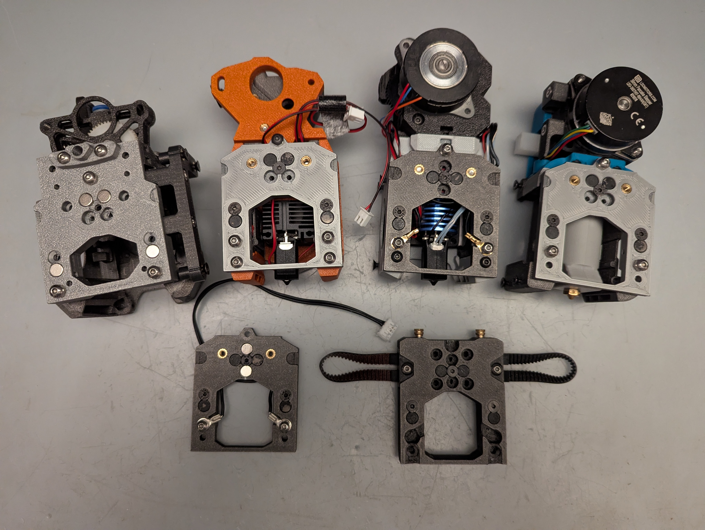
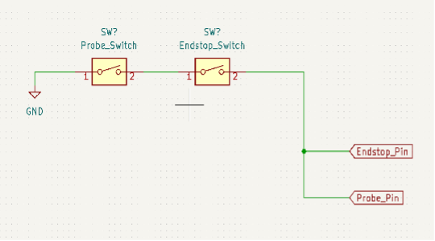
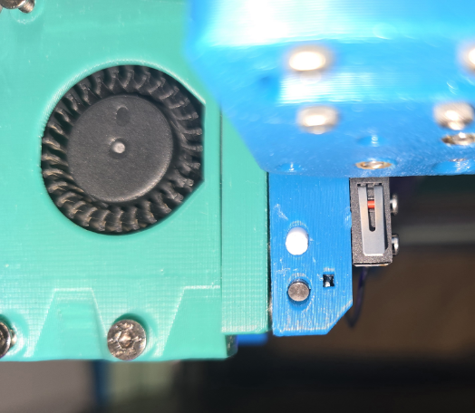

## Getting Started

Step one is to choose the options for your printer.  Top questions are in this section; many options are tied together, so the safest approach is generally to use a complete setup known to work, like one of the first beta builds.

**Printer Type?** Good news everyone! Many printers with a front-facing X rail and XY-motion-head will *potentially* work.

Static-gantry and flying-gantry CoreXY and Cross-XY printers are game, but not bed slingers - because Y motion is needed to detach the head, and you don't want to be slinging your other tool around on the bed.  

**Main printer?**
Yes, the conversion can be on your main printer, surprisingly.  The carriage/plate design is robust and reliable, after 100s of hours of beta-program testing and many design iterations.  You can even just use the core as a probing-capable or easy-detach head, try it out, and then decide if you want to add a second head and docks.

**Change Frame?** Travel loss will depend on the configuration.  Square static-gantry printers necessarily lose the front corners when using both extruders.  If you want to enlarge the frame, consider whether to go wide, deep, or tall; all can work, though a tall setup with frame-mount docks will take longer for toolchanges and be harder to tune as a result.  The picture below gives a sense of this space loss, with a simple and probably overly optimistic loss of 54mm wide x 57mm deep, for a range of common bed sizes.

Expanding your frame is premature optimization, if you don't have a driving use case.  You can always build this with what you have, then make that larger financial and time decision, later.  It's not just the cost to expand the frame and buy panels and longer rails, it's the time to remount and replace parts too.

Remember though, that this loss is almost entirely in two-extruder mode.  With a single extruder, you don't lose the front corners, though you may lose a little bed of bed from doing a bed Y shift.  Speaking of which...

**Shift the bed?** If your frame has no overtravel, you need a bed shift in Y to avoid the inactive nozzle touching your bed - either melting the build plate, or preventing bed leveling.  On some printers, like Trident, there is built-in overtravel which helps clear the nozzles, as well as give space to use something like a Nudge probe too.  Some methods to achieve a Y shift include:
* Adding bed-shift mounts to a bedrame, like the Tri-Zero bed mounts - or removing them and direct-mounting to an extrusion (like Zruncho did for MM.000)!
* Modifying front Z attachments to shift the bedrame pivots
* Doing nothing; if the MadMax core shifts your head forward already, no additional motion may be needed
* Moving the printer front forward, with a fridge-door mod, to create clearance for the front shift.

**Which dock type?**
Docks come in a few flavors:
* Null - probing only, as a Tap or Boop replacement
* Gantry-attached: only XY motion needed to dock/undock; the most likely choice here, but less convenient for more than 2 heads.
  * "Stalagmite" - sticks up, like Ambrosia's Trident docks
  * Slip-over - wraps around idlers, above and below, like Yeri's Salad Fork docks
  * Idler-attached/integrated - connects to, or replaces, front idlers; more compact, but harder to evolve
  * Monolithic - provides idler base, box that connects to a frame, like Zruncho's T0 docks
  * "Stalagtite" - hangs down, as seen on Zruncho's Dueling Zero prototype docks.
* Frame-attached: Z motions required, similar to Tapchanger/Stealthchanger docks, and for flying gantries only.
  * Many of the above design may work just fine, as long as they have added clearance for the flying gantry.

With the exception of Zruncho's T0 docks, which only fit OmniBrick, all the others keep the same dock-FHCS spacing as DragonBrick's original docks: 20mm Y spacing, 54mm Z spacing.  You still need a dock that matches your chosen head's offset, too.

**Which toolhead/extruder?** Fortunately, you have choice!  

See below for ones that use the MadMax reference design - a square of holes for FHCSes, where those screws are in parallel plane to the printer's sides, with keyslots to hold the head using the FHCSes and magnets to keep them in place, even when the umbilical pulls backwards and the head weight wants to twist the head forward.

Note that MGN9H vs MGN12H MadMax core parts, as well as different belt sizes and spacings, are not compatible, however many toolheads use compatible parts (assuming the same rail size, belt size, and belt spacing).

## Select a toolhead/extruder combo

Either you pick a toolhead which is (1) already compatible with the Mini Stealthburner 3-hole pattern - DragonBurner, Dragon, OmniBurner, AntHead, etc. - (2) already compatible with Xol-carriage like Andrewmcgr's A4T/Xol plate - or (3) modify the MadMax plate to support your current toolhead of choice.

There are lots of known-good choices here, many “brickified” - that is, with:
* front-top-mount square toolhead boards
* slab sides to hold the dock screws

A few of the supported heads: A4T, AntHead, OmniBrick, DragonBrick:

|  |  |
| --- | --- |

A brickified toolhead is not a requirement, but it’s a good fit for any MadMax printer.  Why?  By moving the toolhead board from the back to the front, you reduce the chance of one head hitting the rear of the other, which typically frees up Y travel (up to 20mm).  This increase is meaningful with MadMax conversions, especially at the smaller Printers for Ants scale: more Y travel means more usable print volume for two-extruder prints.  Beyond that, the toolhead board mount can be more rigid, can potentially yield more useful input shaper measurements, and moves wires away from the Maxwell coupling, so they can’t catch and break.

Brickified toolheads tend to be harder to make when there’s a large shaft in front (G2E) or when the filament drive gears are fairly wide (Bondtech style).  Newer thinner-gear extruders (HGX2.0, LGXL2, K1), or extruders that don’t stick out much beyond the filament path (PapLite), tend to be more popular with MadMax conversions.

### DragonBrick/RapidBrick, by Rob

The DragonBurner and RapidBurner are toolheads by Chirpy, which are super-narrow (54mm wide), have wide extruder support, and have good cooling from 40mm fans.  They use a 3010 hotend fan.

Rob developed DragonBrick and DragonBurner based on these, with modifications for toolchanging using MadMax docks, plus matching extruder mods with a square front toolhead-board mount and cover to keep the wires tidy.  This is a surprisingly narrow and compact-in-depth setup, especially with the K1 extruder mod.

The full list of modifications include:
* Reshaping the front Cowl for more rigid air ducts
* Squaring off one side of the ducts and working in holes for FHCS screws for docking
* Custom extruder mount for a Modified K1 Extruder
* Modified K1 Extruder face place for EBB42 mounting
* Custom electronics shroud
* Other small QoL changes.

As a mod, these toolheads accept available Dragon Burner and Rapid Burner hotend mounts.

A .step file is provided for the entire brick version of the toolhead, which is designed around a modified K1 extruder and EBB42 board.
 * K1 Extruder parts links:
   * AliExpress
     * [Extruder body](https://www.aliexpress.us/item/3256804562096106.html), $20.50
     * [Motor, 10-tooth](https://www.aliexpress.us/item/3256805685028416.html), $14
   * Amazon
     * [Extruder Body](https://www.amazon.com/Creality-Extruder-Upgraded-Extrusion-Mechanism/dp/B0CJV1L2XG), $20.30

### A4T/XOL, by andrewmcgr

The A4T is a solid option, intended for longer, higher-flow hotends, with dual 40mm fans, a 2510 hotend fan, and CFD flow optimization for strong cooling.

Unlike other toolhead options, andrewmcgr added support for the A4T and XOL by modifying the MadMax plate to have its own L-shaped piece to hold the dock screws, instead of modifying the *toolhead itself* to add those.  It sounds like it will be flimsy, but feels and is prenty strong in practice.  Plus, there is no need to port toolhead changes in the future.  Both toolhead options share the same modified plate.

There is an optional modified MGN12H carriage which adds Beacon/Cartographer support, provided by this mod, too.

It retains full X travel in toolchange model; either head can reach the full width of the bed, except for the forbidden areas around the docks.

Andrew says: "Combined with full Y for some of the bed, and it reduces the bed area by less than 15%... though it does mean (with the docks done this way) that you don't get the full diagonal length. Doing extrusion-mount docks would allow for putting them all over one side and keep access to the diagonal, though at that point it also makes sense to build an extended-Y printer with extra overtravel.   Just for size reference... 5x4 gridfinity case fits with a ton of spare room... or all the skirt parts for a 350 Trident at once."

### A4TBrick, by Telxoid

A very different approach to andrewmcgr's, and more like the others: this mods the toolhead cowling to add screw holes for the dock screws.  

It also includes a modified PapLite front plate with holes for a square 42mm toolhead board, as well as a toolhead board cover, which somewhat "brickifies" the A4T.

This option uses Andrewmcgr's plate mod, but ignores the side-L-plate mount.

### Anthead Mod, by r2pdx

[AntHead](https://github.com/PrintersForAnts/AntHead/tree/main) is hartk’s latest toolhead design, which also uses 2x 4010 and 1x 2510 hotend fans.  It's cleanly integrated, hides some wires, and looks good.  Its extruders generally have a third screw on the rear which more solidly locks them to the cowling, and it's only slightly wider at ~55mm than the 54mm DragonBrick.

r2pdx on Discord is Joseph Greiner on GitHub, and whoever they are, they've made it easier to use the AntHead by modifying the cowling to support the usual MadMax dock screws.

This choice uses the same parts as the DragonBrick option; they add a bit of Y distance, but share the usual MiniSB 3-hole mounting.

### OmniBrick, by Zruncho

OmniBrick exists to give more space needed to use Nudge with a V0, plus enable the use of a PapLite extruder with a third mounting screw, for added stability and better resonance-testing results.

OmniBrick is based on [OmniBurner](https://www.printables.com/model/854317-omniburner-universial-mini-stealthburner-for-most) - Kevin’s “fits all extruders” chopped MiniSB derivative.

OmniBrick is Zruncho’s de-stealthed OmniBurner derivative (via copious face deletions), which has front Huvud and EBB42 support with a PapLite, plus two rear heatset holes.  You can use pretty much any extruder, but the PapLite fits well with a square front toolhead board.

The Papilio Lite (PapLite) is Kevinakasam’s compact, strong belt extruder.  A belt extruder provides high grip and won't grind filament, at the cost of some extra weight.  It has a short distance from filament entrance to front plate, which makes a front toolhead board possible.   NOTE - pictures show the newer slimmer [HGX2/TBG gear option](https://github.com/kevinakasam/Papilio-Belt-Extruder/tree/main/Papilio%20Lite/_Ignore/HGX2.0xTBG) which enables ~8mm more Y travel, but these gears are not available as of 2025-04-06. Instead, we recommend either the r3 version or the TheFPVGeek-modified TPU-capable version (on the Kevinakasam Discord).

See [notes in Kevin’s Discord](https://discord.com/channels/964441223169449984/1240233572464459776/1245649529563385856). Also, [build instructions exist](https://kevinakasam.com/papilio-lite-build-instructions/), but are outdated.

You don’t have to use a PapLite and the included front square-toolhead-board mount.  But then you’ll lose some Y where the toolhead board sticks back and would hit the front of the other toolhead.

### Yavoth

Supposedly a bit more solid and more tightly packaged.

If you already have it and like it, and you have a bit more travel though (PB, PB0, SF, …) it’s a fine option, especially to get started.

### Other choices

Stealthburner and Archetype are not currently supported, and may never be.

The main caveat is that the magnetic-only design is not optimized for heavier toolheads, and if you want the Maxwell probing as a bonus, then the additional magnet force needed to hold the heavier “full SB” head up means a higher amount of probe force.  PZ, Klicky, Beacon all get around that, and should work fine, so it's not a blocker, but you would be the first to try out a full size toolhead.

It’d be pretty cool though.

The "widebody" MiniSB with added side plates was part of beta1, and it fits and looks cool, but it's not ideal for a 120mm V0, because you can’t do a front-mount Nudge on a V0; it's just slightly too wide to leave the required amount of travel. OmniBrick and StealthBrick are good options that allow a perma-mounted Nudge.

## Decide on Homing Method

In theory, sensorless homing should be accurate to a full step, which should be more than accurate enough for our use. The docks allow a bit of imperfection while still being reliable.

But in practice, any tiny issue with your build can make it finicky, and turning can depend on friction, which depends on belt tension, which can change.

The easy and reliable solution is to install endstop switches. The X-endstop can be mounted to the carriage and wired in line with the maxwell-probe.  See the example below.

| |  |
| --- | --- |

Go for sensorless homing only if you’re 100% confident in your sensorless tuning, or if you’re willing to put a lot of time into getting there.
