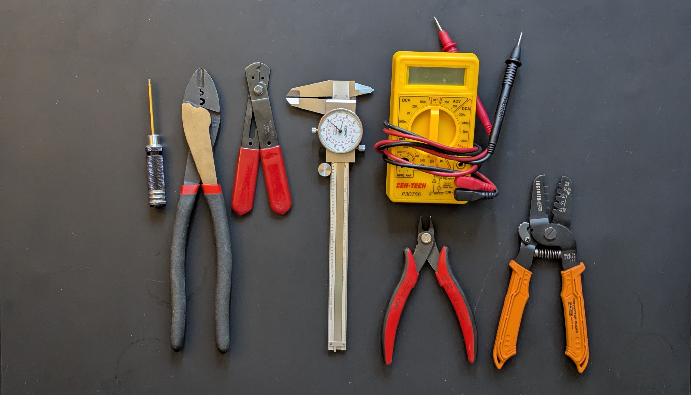
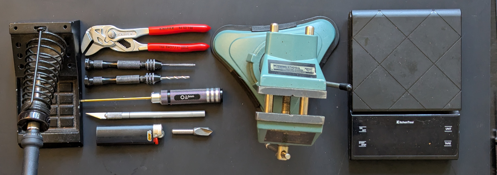
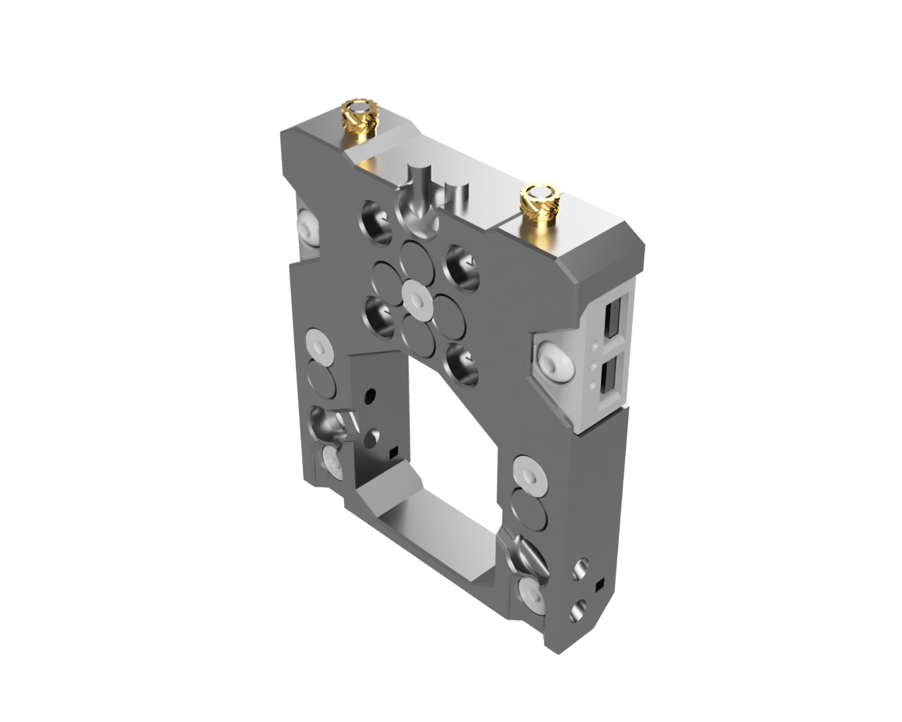
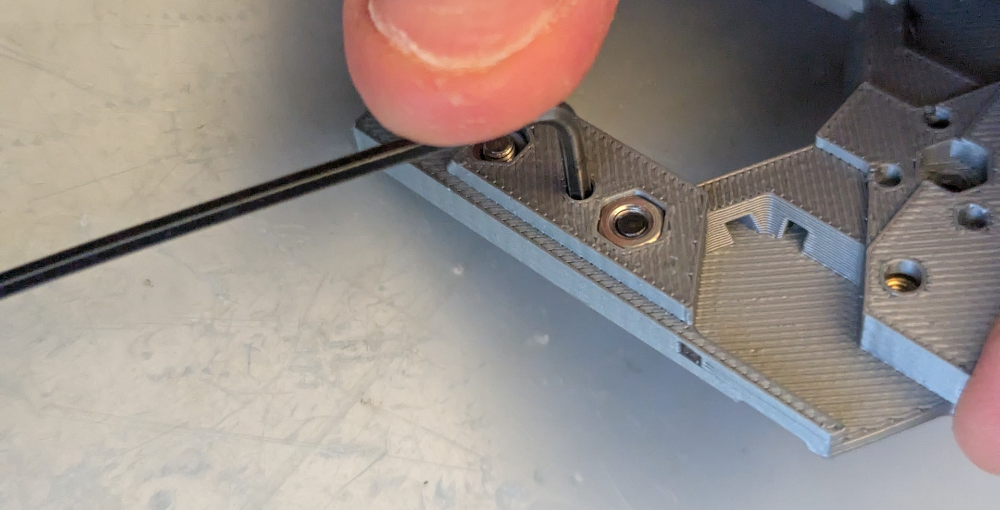
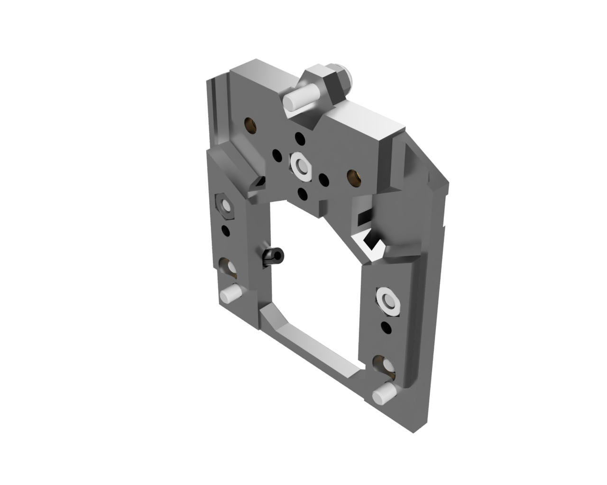
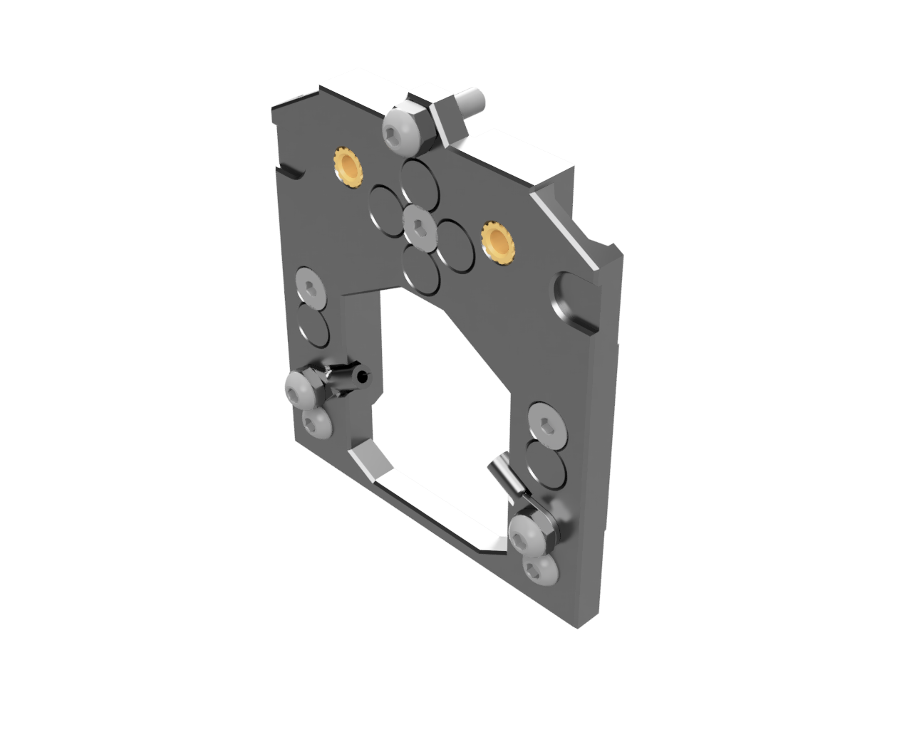
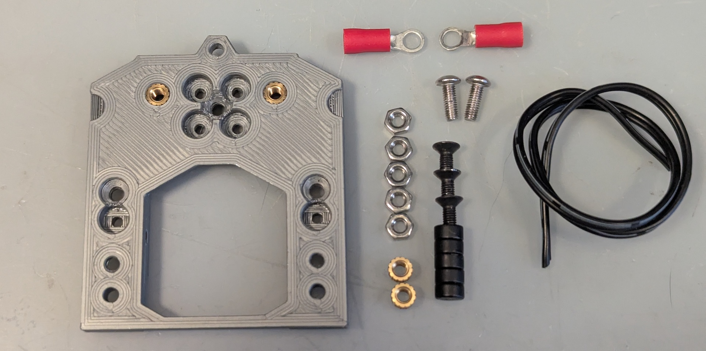
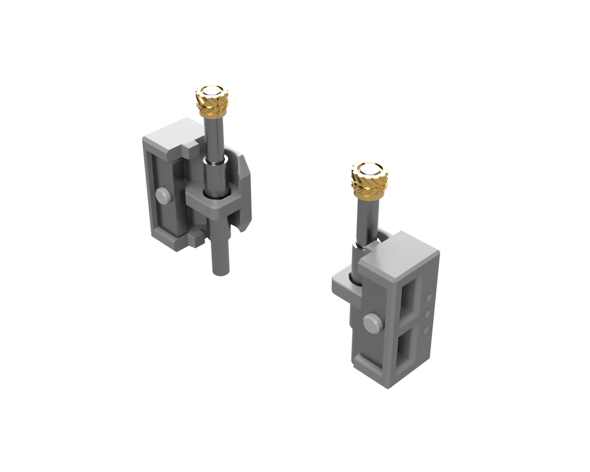

## INSTRUCTIONS.md

**Follow the instructions here to ensure a high-quality build.**

Sure, you can just look at the CAD and BOM and ignore the instructions (or any build videos).

But please… don’t do that. There are some non-typical techniques used here, like reaming holes to match pins, plus intentionally overtorquing screws to match-fit holes.  

Order matters, too.  The fastest approach is to build the carriage and plate, then test them together first, then put them on the printer and actually print with them.  

Only then, should you proceed to the dock-side hardware and other software configuration.  Breaking the steps into smaller testable pieces, with intermediate milestones, tends to keep builds on track.  

You can do it!

If you experience issues, check the [Troubleshooting](TROUBLESHOOTING.md) page first.

### Print Settings

Regular Voron **toolhead** considerations (materials and printing) apply here, as critical parts are millimeters away from a heated bed.  They will be subjected to high heat, and you want them as resilient as possible.

**Settings:** All parts will print at stock Voron settings (0.4mm nozzle, 0.2mm layer height, 4+ walls, 5 top/bottom, 40%), but more perimeters, top/bottom layers, and more infill will help ensure rigidity.  You want these parts strong, so print extra extra hot, in a hot chamber.  The bridges are short, anyway!

**Material:** ABS works fine to print PLA in unenclosed systems, but in an enclosure, especially a well-insulated one, the carriage and plate see high temps, so use a more temperature- and creep-resistant plastic if you can.  ASA is recommended over ABS, but PC or PC-ABS are even better.

**Test Print:** A `Test_Print.stl` is included; print this part to confirm your sizing first.  The magnet should press in with force, the FHCS should snap into place, the heatset should fit securely, and the part should be at the right height.

**Parts:** Print all parts matching your carriage size and toolhead type. Typical printing:
* 1x Carriage
* 2x Plates
* 2x Belt Clips
* 2x Docks
* 2x Toolhead parts (cowling, extruder, TH board mount, ...)

The no-brace MGN9 plate is for Dragon heatblocks, to add clearance.

For all docks and toolhead parts, check with the provider.

**Tools:**
The following tools are required for a complete build:

* 2mm straight hex driver (not balldriver) - for M3 BHCS
* Crimp tool - for ring terminals
* Wire stripper
* Calipers
* Multimeter
* Flush cutters
* Wire cutters

Optional tools, but recommended:

* (If homing with endstop switch)
  * Soldering iron
  * Lighter or heat gun for heatshrink
* Pliers Wrench (Knipex 180mm+ length preferred) - for magnet insertion
* 3mm Reamer [Amazon](https://www.amazon.com/dp/B07K49B4LC)
* 1/8" Reamer [Amazon](https://www.amazon.com/dp/B07JPDSSBM)
* Holder for reamer and hand drills [Amazon](https://www.amazon.com/dp/B07TRGW3W7)
* 2.9mm drill bit
* 2.5mm straight hex driver (not balldriver) - for M3 SHCS
* X-acto knife
* Countersink - for part cleaning
* Bench vise
* Scale for measuring probe force [Amazon](https://www.amazon.com/dp/B08SM4TB8P)

### Carriage
Build the carriage first, so you can match both plates to it.

|  |  |
| --- | --- |
| Front | Rear |

Parts needed:

There are two types of FHCS used here: magnet-retention screws up top (3x, stainless or alloy), plus electrical-connection screws below (2x, must be stainless).
* Tips
 * Create a “nut push tool”: an M3x8 SHCS plus M3 nut, twisted into a spare M3 T-nut.  Later - adjust the depth to ensure nuts get pushed-in fully to the plastic part!  
   
 * If magnets don’t fit, likely because the print is overextruded, use a 6mm drill bit or reamer plus spot of glue.
 * Magnet removal: All magnets can be removed from the backside by pushing hard with the short side of an allen wrench, like this:
 
* Prep
 * Clear any elephant foot for magnet holes with a countersink bit.
 * Clear out the 4x carriage-mount holes with a 3mm reamer or drill bit.
 * ⚠️Measure your pin diameters with calipers.  You want holes right at the measured size, with whatever drill bit or reamer you have.
   * Plastic can have some slight dimensional variation here.  Steel pins should be spot-on.
 * Clear out the 2 top holes for the belt-clip pins with a reamer.  Test it with a pin; you should have a loose slip fit, where the pin inserts and removes easily.  Tension and gravity will hold it securely in place.
 * ⚠️GENTLY clean all 6x pin holes with a reamer, to avoid the carriage splitting between layers when you add the pins.  A light twist is probably more than enough.
 * Make plastic pins (4x)
   * Typically 9-10mm is a good length for these.  To cut acetal, DON’T use a tube cutter, as you may destroy it!  Use something stronger, like thick wire cutters or flush cutters.  Mark a length with a Sharpie, then cut to length, then trim the ends for easier insertion.
 * (Endstop-switch-based homing option only - recommended)
   * Cut two 60mm wires and strip one end of each.
   * Solder and heatshrink both wires to the switch.
 * (Sensorless homing option only)
   * Cut and strip both ends on one 60mm wire.
* Add pins
 * ⚠️Be super gentle, to avoid layer separation.  If you’re experiencing resistance, push out the pin, then ream out the hole slightly more.
 * Metal pins (2x)
   * The metal pins are the two lowermost ones on the carriage, which complete the circuit.
   * Press pins until fully inserted, from the outside, until they just touch the inner “leg” edge.  Start with fingers, then push to fully inserted by pressing against a flat surface.
 * Plastic pins (4x)
   * Press the two middle-height pins in, from the outside, until you can't see the ends.
   * Press the two upper pins in, from the top down, until they hit the stops.
     * Yes, the top ones stick out intentionally, for easy removal with flush cutters.  
   * All other 4 lower pins can be removed later using an allen wrench, pushing in on the holes.
* Add magnets
 * ⚠️Decide how many, and which type, of toolhead magnets to use.  The toolhead weight, carriage size, and probing type affect the choice.
   * Always balance the magnets around an FHCS, so it doesn’t twist out.  Don’t use 3 magnets; always use 2 or 4.  Use a weak 3rd + 4th magnet for balance, or just use 2.
   * Lighter toolheads may be OK with weaker grip; for example, 2x N52 for a 280g toolhead.
   * Heavier toolheads (350g+) will need more magnetic force for a solid toolhead grip; typically 3x N52, minimum.
   * Be careful to get the polarities right!  You want neighboring magnets to have opposing polarities, for more grip.
 * Push the magnets (toolhead + lower 2) to where they hold in place, then use a pliers wrench, small vise, or body weight and a flat surface, push.  If pressing with fingers, find a slightly larger-dia magnet or other surface to prevent going in too far (say, 8mm dia magnet).  They should press-fit flush without issue, then hold without anything else.
* Add upper nuts
 * Fully insert the 3x nuts that will secure the magnet-retention FHCSes.
* Add magnet-retention FHCSes
 * Add 3x magnet-retention FHCSes; tighten until the FHCS heads are flush.  Yes, you’ll apply a lot of force here, and the magnet will move down slightly.  To check flush-ness, use a rigid PCB ruler if you have one.
* (Sensored homing only)
 * The orientation of the switch (plunger up, or plunger down?) will depend on the printer type.
 * Secure the endstop switch with two M2 self-tapping screws; fully tighten them, but be careful not to overtighten.
* Add electrical-wire connections
 * Slip an M3 shim in from the bottom.
 * Push a shiny metal FHCS through the washer, so the washer stays in place.
 * Push wire into place.  No wire insulation should overlap the washer and nut.  You want a solid connection, so try to bend the wire around the screw before the nut comes in.
 * Add nut and push down (using push tool), then tighten screw fully.
 * Pull wire hard, to confirm connection quality.
 * Repeat for the other side; trim and restrip if desired.
* Test
 * Using a multimeter, ensure an electrical connection from Maxwell metal pin to metal pin.  You should see near-zero resistance.

### Plate

|  |  |
| --- | --- |
| Front | Rear |

Parts needed:

* Prep
 * Clear any elephant foot for magnet holes with a countersink bit.
 * Match-fit the upper Maxwell coupling screw hole by overtorquing with an M3 screw, then remove it.
 * Setup the 3 Maxwell BHCSes:
   * For the upper, use an M3 nut, typically 2.2-2.4mm in thickness; measure what you have first.  Using pliers and a straight allen wrench, lock the nut to the end of the button head.  The screw length will depend on your toolhead choice.
   * You want to match the thickness of the two lower maxwell screw assemblies to the upper.  Measure the thickness of your crimp terminals (typically 0.3mm to 0.8mm) and use either jam nuts (typically 1.8mm thick) or stacked 6mm-OD 3mm-ID washers to get as close as possible to 2.2mm thick, but not lower, and as matched as possible.  0.2mm mismatch is OK; the docks and the printer will be fine with a tiny bit of misalignment.
 * Heat-press the 2x heatsets for the toolhead screws and ensure they’re flush.
 * Heat-press the 2x heatsets for the Maxwell coupling, through the print-bed side.  Despite being the "wrong way" to resist pullout, pullout forces are low here, and the orientation means more of the heatset will be in contact with the crimp terminals, for a better electrical connection.
* Add magnets
 * In this step, you'll use the carriage to ensure the correct polarity of magnets on the plate.
 * Add one magnet to the carriage.
 * Push the plate into the carriage, so this magnet is mostly inserted.
 * Repeat with all remaining magnets.
 * Fully insert all magnets until flush, using a pliers wrench, small vise, or against a flat surface.
* Continue, following the same steps as the carriage:
 * Add magnet-retention-FHCS nuts (3x)
 * Add magnet-retention FHCSes (3x)
* Feed wire into position
 * Figure out which side you want the wires to go, remembering that the plate will be flipped.
 * Trim one wire side slightly shorter, and feed it straight down, through the vertical slot, to where it can enter the screw/nut area.
 * Route the other end of the wire through the 3 tunnels.  Adjust the length of the short or long wire to match; both should just touch the bottom brace.
 * Strip both wire ends 6-8mm, or whatever length works best for your crimp terminals.  Need more length?  Pull it through.   Excess may be taken up at the toolhead.
* Add electrical-wire connections
 * Using the crimp tool, crimp the ring terminals to the wires.
 * Put the crimps in place, with the thick part facing into the cutout, and for each, add the M3x8 BHCS-nut assembly and fully tighten.
 * Strip the upper ends a few mm - just enough to connect to the multimeter.
* Test
 * Put the plate on the carriage, gently.  DO NOT let them click hard into place.  You can damage the soft screw heads.
 * Look at area between plate and carriage, from the side, with a light source behind.  You should see a fraction of a millimeter, all over.  All FHCS heads and magnets should be flush.  If you can see the screw heads or magnets popping out even slighty, fix them to be flush, to avoid hard-to-diagnose issues from rubs.
 * Using a multimeter, touch the lower Maxwell screw heads, confirm that the toolhead + plate combo has continuity in the default position and doesn’t when you press up gently on the plate.
 * The “Maxwell coupling switch” here should have a discrete, clicky feel, and return into position reliably.  If it’s mushy, you need to find the rub and fix it, or find the loose part.
* Lockdown
  * ⚠️Threadlocker on ALL 3 Maxwell screws is a smart choice - Yeri and Zruncho have both experienced issues from screws loosening over time, from probing and attach/detach motions.  Add it.
* Repeat steps above for each plate.

### Pins and Belt Clips

|  |  |
| --- | --- |
| Front | Rear |

Parts needed:

**Pins**
* Drill out 2x M3 heatsets using a 2.9mm or similar drill.  Get close to 2.95mm or so, and leave a small taper on the narrow side.
* Using a small tabletop vice or pliers wrench, press heatsets into the flat end of 3mmx35 pins.  The wide end should align to the pin end, and be flush.

**Belt Clips**

* Prep
 * Remove the tiny custom support for each belt clip, near the screw hole.  Clear the support area with an x-acto or flush cutters, if needed; you need the M3 t-nut to fit here.
* Add M3 t-nut in place and then add M3 BHCS, keeping it as open as possible, but still holding the t-nut with at least two threads.
* Practice Install
 * Before going to your printer, get the feel for belt installation, with a piece of spare belt.
 * Feed the spare belt through the entrance with the teeth facing the front and fold it back on itself (where the teeth face each other) and push it through.
 * Adjust the positioning, a belt tooth at a time, to where maybe 2 teeth are exposed beyond the clip.
 * Drop the tube in, halfway, so it holds in place from the belt squeeze.
 * Repeat for the second belt, then press the tube in fully.  Make sure they exactly match; if off by one tooth, you'll see a 1mm error where one belt tooth is half-shifted to the opposite side.
 * Fully tighten the M3 screw.
 * Push clip into carriage and press the pin down.  It should drop in with minimal-to-no force.
 * Repeat for other clip, for more practice.
 * Adding belt clips with tubes goes fast, once you get the hang of it!  SpeedClips can be adjusted in-place, which makes the initial setting faster.  It's how they got their name.
 * Tip: to have fast belt-clip reattachments or initial settings, using a metallic silver Sharpie, mark the first visible tooth on the long (continuing) belt side.  Measure the number of teeth and use it as a reference for other belt ends; mark those to match, and it goes FAST.
* Real Install
 * Loosen the screw and ditch the practice belts, and repeat on the printer.  We’re doing this live.  Get excited!

BEFORE messing with docks and toolchanging and all that config, get the damn thing printing and test the build quality!

You now have a lighter-weight, lower-cost Tap replacement that enables painless nozzle swaps and maintenance.  You should only need to:
* Add crimp terminals and a crimp terminal housing to the plate for the toolhead board
* Update a pin in your Klipper config for the probe
* Add the carriage and clips to the printer
* Add grease to the metal pins for better longevity

Then you can test probing functionality, probe accuracy, and get updated resonace-testing results.  All those will confirm that you have a good build.

What to expect:
* Homing with the probe should just work, with some visible carriage motion.
* The coupling should return to the connected position, reliably.  If it doesn't, you have too much friction or crappy magnets.
* `PROBE_ACCURACY`: run with SAMPLES=100 to work it in.  Ignore what you're looking at; the grease and parts need to settle.
  * Then do SAMPLES=10 and expect sub-0.01mm range and lower standard deviation (sub-.002mm).
* `Z_TILT_ADUST` or `QUAD_GANTRY_LEVEL` should work fine, next.
* Resonance testing should be clean, and possibly much better than before; the head should be well-balanced and rigidly connected.  It took a lot of work to shift the head downward to improve balance and improve cooling flow.

Before printing, make sure to update the Z offset for yur toolhead head... the offset will depend on your printer and the magnet configuration, but 0.4mm is a reasonable starting point.

### Toolhead and Docks

Most MadMax toolheads use 3 or 4 M3 FHCSes sticking out from the front, which slide into a dock, and are held by magnets, along with standard keyhole geometry.

For each toolhead, add your 3-4x FHCSes, and measure the distance from the flat screw top to the flat toolhead surface with the tip of calipers. The magnets in the dock should be about 3mm inward from the flat surface, and you want to match this distance to maximize magnet grip.

For each dock, add 3x-4x magnets from back, until they hit the lip, partially.  

Check with your dock maker for any other instructions.

BTW, you can add just one toolhead and test out docking and undocking if you’d like. You don’t actually need more than a shroud with a hotend and a toolhead plate to be connected; you can always add a plate extension cord to the mainboard, before setting up the toolhead board, to play.

Continue to the [Configuration](Configuration.md) section next!